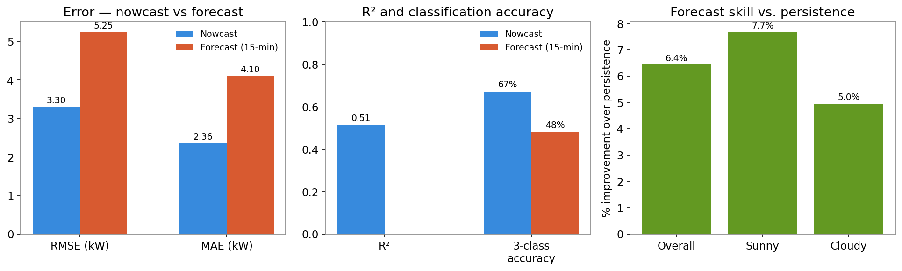
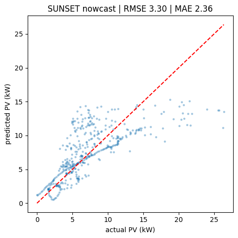
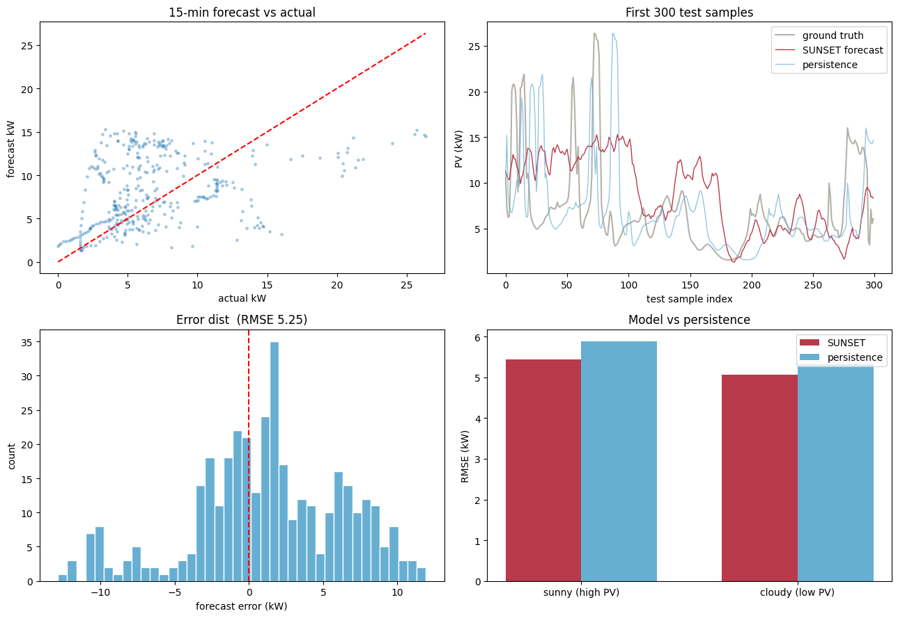

<div align="center">

# ☀️ SUNSET — Sky-Image Solar Power Prediction

**Predicting solar power output from the sky, one image at a time.**

Two convolutional neural networks that turn a photo of the sky into a power
number — one for **right now**, one for **15 minutes from now** — trained and
evaluated end-to-end in Google Colab.

</div>

---

## What this project does

Solar power output swings constantly as clouds pass overhead, and grid
operators need to know those swings *before* they happen. This project builds
two CNNs that read a sky image and predict how much power a rooftop solar
array is producing:

| | 🔵 Nowcast | 🔴 Forecast |
|---|---|---|
| **Question answered** | "How much power right now?" | "How much power in 15 minutes?" |
| **Input** | one sky image | 16 sky images + 16 past power readings |
| **Output** | current PV power (kW) | PV power 15 min ahead (kW) |
| **Test RMSE** | **3.30 kW** | **5.25 kW** |
| **Beats baseline by** | 30% (vs. mean) | 6.4% (vs. persistence) |

---

## Results at a glance

<div align="center">

</div>

The nowcast is more accurate than the forecast — expected, since estimating
the present is easier than predicting the future. Both models explain a
meaningful share of the variation in power output and beat their respective
baselines by a healthy margin.

---

## 🔵 Nowcast — predicting power *right now*

A single 64×64 sky image goes in; a power number comes out. Bright, clear
sky → high power. Clouds over the sun → low power. The model learns this
mapping directly from image pixels.

### How well it predicts

<div align="center">

</div>

Each dot is one test image: x-axis is the actual power, y-axis is what the
model predicted. Points near the red dashed line are accurate. The model
tracks the overall trend well, with more scatter in the mid-range where
partly-cloudy conditions are genuinely ambiguous from a single frame.

### A full test day, minute by minute

<div align="center">

</div>

The model (blue) follows the shape of the real power curve (grey) through a
volatile, partly-cloudy day — catching the big ramps even if it smooths out
some of the sharpest spikes.

### Where the model is confident vs. unsure

<div align="center">

</div>

Grouping power into **Low / Medium / High** bands: the model is excellent at
telling Low and High apart (a sky is either clearly clear or clearly
overcast), and least confident in the Medium band, where lighting is
ambiguous even to the eye. Overall 3-class accuracy: **67%**.

---

## 🔴 Forecast — predicting power 15 minutes ahead

The forecast model doesn't just look at the current sky — it watches a
16-frame sequence to catch cloud *motion*, and combines that with the last 16
power readings to catch the current *trend*. Predicting the future is a
fundamentally harder problem than reading the present, so this model is
benchmarked against **persistence** — the standard baseline in solar
forecasting, which simply assumes "power in 15 minutes = power right now."

### Full evaluation panel

<div align="center">

</div>

Four views of the same result: **top-left** — predicted vs. actual scatter;
**top-right** — a 300-sample slice showing the model (red) tracking real
power (grey) more closely than persistence (light blue); **bottom-left** —
the error distribution is centered near zero, meaning no strong bias;
**bottom-right** — the model beats persistence on both sunny and cloudy
conditions.

### Training convergence

<div align="center">

</div>

Validation loss drops sharply in the first few epochs and levels off —
early stopping catches the best checkpoint before overfitting sets in.

### Where the model is confident vs. unsure

<div align="center">

</div>

Same Low/Medium/High breakdown as the nowcast. Forecasting is harder, so
accuracy is lower overall (**48%**), but the pattern is the same: strongest
at the High-power extreme, weakest in the ambiguous Medium band.

---

## The model architecture

Both models share the same core: a compact **SUNSET CNN** — two
convolution blocks, each running `Conv2D → BatchNorm → MaxPool`, followed by
two dense layers with dropout. The forecast model adds a second input branch
for the power history, merged in after the image features are flattened.

```
Nowcast                                  Forecast
────────                                  ─────────
Image (64×64×3)                          Image sequence (64×64×48)  +  PV history (16,)
   │                                          │                          │
Rescaling                                 Conv block 1 ──────────────────┤
   │                                          │                          │
Conv block 1                              Conv block 2                   │
   │                                          │                          │
Conv block 2                              Flatten                        │
   │                                          └──────── Concatenate ─────┘
Flatten                                              │
   │                                          Dense(1024) + Dropout
Dense(1024) + Dropout                                │
   │                                          Dense(1024) + Dropout
Dense(1024) + Dropout                                │
   │                                          Dense(1) → forecast kW
Dense(1) → nowcast kW
```

| | Nowcast | Forecast |
|---|---|---|
| Total parameters | 13,645,937 | 13,672,041 |
| Trainable parameters | 13,645,793 | 13,671,897 |

Both are trained as a **3-model ensemble** using **day-block
cross-validation** — entire calendar days are kept intact and shuffled as a
block, so no day's images ever appear in both training and validation. This
prevents the model from "cheating" on near-identical, minutes-apart frames.

---

## Results in full

### Nowcast — regression metrics

| Metric | Value |
|---|---|
| RMSE | 3.303 kW |
| MAE | 2.356 kW |
| MBE (bias) | 0.187 kW — near zero |
| R² | 0.514 |
| Correlation | 0.720 |
| Skill vs. mean baseline | 30.3% |

### Forecast — regression metrics

| Metric | SUNSET | Persistence |
|---|---|---|
| RMSE — overall | **5.247 kW** | 5.608 kW |
| RMSE — sunny | 5.432 kW | 5.883 kW |
| RMSE — cloudy | 5.056 kW | 5.320 kW |
| MAE — overall | 4.103 kW | — |
| Skill vs. persistence | **6.4%** | 0% (reference) |

---

## Try it yourself

Both models are deployed as interactive **Gradio** apps — upload a sky image
and get a live power prediction.

```python
iface = gr.Interface(
    fn=predict_pv,
    inputs=gr.Image(type="pil", label="Upload a sky image"),
    outputs=gr.Number(label="Predicted PV output (kW)"),
    title="SUNSET PV Prediction"
)
iface.launch(share=True)
```

---

## Project structure

```
├── SUNSET_nowcast_colab.ipynb     # nowcast: load → train → evaluate → deploy
├── SUNSET_forecast_colab.ipynb    # forecast: load → train → evaluate → deploy
└── assets/                        # charts used in this README
```

---

## Data

Sky images (64×64 RGB) paired with concurrent solar power readings, one
month of data with day-block train/validation/test splits to keep evaluation
honest — no day's images leak across splits.

| Split | Nowcast samples | Forecast samples |
|---|---|---|
| Train / validation | 2,416 | 1,949 |
| Test | 427 | 367 |

---

<div align="center">

Built with TensorFlow · trained on Google Colab · deployed with Gradio

</div>
